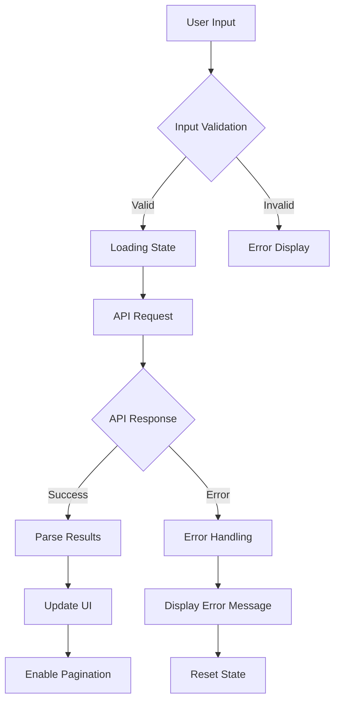
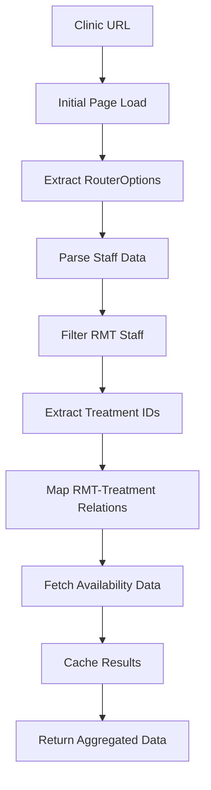

# Technical Specification: RMT Search System via CMTO Integration

**Document Version**: 1.0  
**Date**: July 2025  
**Author**: Technical Architecture Team  
**Project**: RMT Finder & Availability Checker Systems

## 1. Executive Summary

This document outlines the technical specifications for two complementary RMT (Registered Massage Therapist) search systems: an Android mobile application that interfaces with the CMTO (College of Massage Therapists of Ontario) public API, and a web-based availability aggregation system that consolidates appointment data from multiple Jane App booking platforms.

### 1.1 System Components

1. **Android RMT Finder App**: Native mobile application for searching CMTO-registered therapists
2. **Web-based Availability Checker**: Node.js application for real-time appointment aggregation
3. **CMTO API Integration**: Direct interface with Ontario's official RMT registry
4. **Jane App Scraping Engine**: Multi-clinic availability extraction system

## 2. Android RMT Finder App - Business Logic

### 2.1 Architecture Overview

The Android application follows the **MVVM (Model-View-ViewModel)** pattern with the following core components:

```
┌─────────────────┐    ┌─────────────────┐    ┌─────────────────┐
│   MainActivity  │◄──►│  MainViewModel  │◄──►│  CMTOService    │
│   (UI Layer)    │    │ (Business Logic)│    │ (Data Layer)    │
└─────────────────┘    └─────────────────┘    └─────────────────┘
         │                       │                       │
         ▼                       ▼                       ▼
┌─────────────────┐    ┌─────────────────┐    ┌─────────────────┐
│ ProfileAdapter  │    │   ResultItem    │    │ SearchResponse  │
│ (RecyclerView)  │    │ (Data Model)    │    │ (API Response)  │
└─────────────────┘    └─────────────────┘    └─────────────────┘
```

### 2.2 CMTO API Integration Business Logic

#### 2.2.1 Search Endpoint Implementation

**Base URL**: `https://cmto.ca.thentiacloud.net`

**Primary Search Endpoint**: `/rest/public/profile/search/`

**Parameters**:
```kotlin
@GET("rest/public/profile/search/")
suspend fun searchProfiles(
    @Query("keyword") keyword: String,           // Search term (city/name)
    @Query("skip") skip: Int = 0,                // Pagination offset
    @Query("take") take: Int = 10,               // Results per page
    @Query("authorizedToPractice") authorized: Int = 0,  // Authorization filter
    @Query("acupunctureAuthorized") acupuncture: Int = 0, // Acupuncture filter
    @Query("gender") gender: String = "all",     // Gender filter
    @Query("registrationStatus") status: String = "all", // Status filter
    @Query("city") city: String = "all",         // City filter
    @Query("language") language: String = "all", // Language filter
    @Query("sortOrder") sortOrder: String = "asc", // Sort direction
    @Query("sortField") sortField: String = "lastname" // Sort field
): SearchResponse
```

#### 2.2.2 Profile Detail Retrieval

**Detail Endpoint**: `/rest/public/profile/get/`

**Implementation**:
```kotlin
@GET("rest/public/profile/get/")
suspend fun getProfile(@Query("id") id: String): ProfileResponse
```

#### 2.2.3 Data Model Structures

**Search Result Model**:
```kotlin
data class SearchResponse(
    val result: List<ResultItem>
)

data class ResultItem(
    val profileId: String,        // CMTO unique identifier
    val firstName: String,        // Given name
    val lastName: String,         // Family name
    val practiceLocation: String?, // Primary practice city
    val authorizedToPractice: Boolean = false, // License status
    val publicRegisterAlert: Boolean = false  // Alert indicator
)
```

**Detailed Profile Model**:
```kotlin
data class ProfileResponse(
    val id: String?,
    val firstName: String?,
    val lastName: String?,
    val registrationNumber: String?,    // CMTO registration number
    val registrationStatus: String?,    // Current status
    val currentEffectiveDate: String?,  // License effective date
    val currentExpirationDate: String?, // License expiry
    val city: String?,
    val publicEmail: String?,
    val language: String?,
    val primaryPlacesOfPractice: List<PlaceOfPractice>?,
    val languagesOfCare: List<String>?,
    val areaOfPractice: List<String>?,
    val authorizedToPractice: String?,
    val acupunctureAuthorized: String?
)

data class PlaceOfPractice(
    val id: String?,
    val name: String?,             // Clinic/practice name
    val phone: String?,            // Contact number
    val email: String?,            // Contact email
    val city: String?,             // Practice location
    val province: String?,         // Province/state
    val website: String?,          // Practice website
    val active: Boolean?,          // Current status
    val businessAddress: String?,  // Physical address
    val position: String?          // Role/position
)
```

### 2.3 Search Business Logic Flow

#### 2.3.1 Search Process



#### 2.3.2 ViewModel Search Implementation

```kotlin
fun search(keyword: String, append: Boolean = false) {
    if (_isLoadingInternal) return
    
    _isLoadingInternal = true
    _isLoading.value = true
    _error.value = null
    
    if (!append) {
        currentPage = 0
        currentQuery = keyword
    }

    viewModelScope.launch {
        try {
            val response = RetrofitClient.api.searchProfiles(
                keyword = currentQuery,
                skip = currentPage * pageSize,
                take = pageSize
            )
            
            val newList = if (append) 
                (_results.value ?: emptyList()) + response.result
            else 
                response.result
                
            _results.value = newList
            currentPage++
            
            if (newList.isEmpty() && !append) {
                _error.value = "No results found for '$keyword'"
            }
            
        } catch (e: Exception) {
            _error.value = "Search failed: ${e.message}"
            if (!append) _results.value = emptyList()
        } finally {
            _isLoadingInternal = false
            _isLoading.value = false
        }
    }
}
```

#### 2.3.3 Pagination Logic

**Business Rules**:
- Default page size: 10 results
- Automatic pagination on scroll/request
- Maintains search context across pages
- Prevents duplicate API calls during loading

**Implementation**:
```kotlin
fun loadNextPage() {
    search(currentQuery, append = true)
}
```

### 2.4 Advanced Features

#### 2.4.1 Bookmark System

**Data Storage**: SharedPreferences-based persistence
**Business Logic**:
- Profile ID-based bookmarking
- Asynchronous bookmark state management
- Cross-session persistence

#### 2.4.2 Location-Based Search

**Implementation**: GPS integration for "Near Me" functionality
**Business Rules**:
- Automatic city detection via geocoding
- Permission-based location access
- Fallback to manual city input

## 3. Web-Based Availability Checker - Business Logic

### 3.1 System Architecture

The web application uses a **layered architecture** with the following components:

```
┌─────────────────────────────────────────────────────────────┐
│                    Presentation Layer                       │
│  ┌──────────────┐ ┌──────────────┐ ┌──────────────────┐    │
│  │ REST API     │ │ Web UI       │ │ Static Assets    │    │
│  │ (Express.js) │ │ (index.html) │ │ (CSS/JS)        │    │
│  └──────────────┘ └──────────────┘ └──────────────────┘    │
└─────────────────────────────────────────────────────────────┘
                              │
                              ▼
┌─────────────────────────────────────────────────────────────┐
│                   Business Logic Layer                     │
│  ┌─────────────────────┐ ┌─────────────────────────────────┐│
│  │  API Extractor      │ │  Automated Extractor           ││
│  │  (Real-time Data)   │ │  (Metadata Extraction)         ││
│  └─────────────────────┘ └─────────────────────────────────┘│
└─────────────────────────────────────────────────────────────┘
                              │
                              ▼
┌─────────────────────────────────────────────────────────────┐
│                      Data Layer                            │
│  ┌──────────────┐ ┌──────────────┐ ┌──────────────────┐    │
│  │ Memory Cache │ │ Config Store │ │ External APIs    │    │
│  │ (Map-based)  │ │ (JSON Files) │ │ (Jane App Sites) │    │
│  └──────────────┘ └──────────────┘ └──────────────────┘    │
└─────────────────────────────────────────────────────────────┘
```

### 3.2 Jane App Integration Business Logic

#### 3.2.1 Multi-Extractor Architecture

**Primary Extractor (api-extractor.js)**:
- Real-time availability data extraction
- Live appointment slot aggregation
- Treatment-to-RMT mapping

**Secondary Extractor (automated-extractor.js)**:
- Clinic metadata extraction
- RMT catalog building
- Treatment inventory management

#### 3.2.2 Data Extraction Process Flow



#### 3.2.3 Core Extraction Algorithms

**RMT Identification Logic**:
```javascript
function identifyRMTs(staffData) {
    return staffData.filter(staff => {
        const name = staff.full_name || staff.name || '';
        const hasRMTCredential = /\b(RMT|R\.M\.T\.)\b/i.test(name);
        const isMassageTherapist = staff.disciplines && 
            staff.disciplines.some(d => 
                d.name && d.name.toLowerCase().includes('massage')
            );
        return hasRMTCredential || isMassageTherapist;
    });
}
```

**Treatment Mapping Logic**:
```javascript
function mapTreatmentsToRMT(rmtData, treatmentData) {
    const mapping = {};
    
    rmtData.forEach(rmt => {
        const rmtTreatments = treatmentData.filter(treatment => 
            treatment.staff_member_ids && 
            treatment.staff_member_ids.includes(rmt.id)
        );
        
        mapping[rmt.id] = {
            rmtInfo: rmt,
            treatments: rmtTreatments.map(t => ({
                id: t.id,
                name: t.name,
                duration: t.treatment_duration / 60, // Convert to minutes
                price: t.price || null
            }))
        };
    });
    
    return mapping;
}
```

#### 3.2.4 Availability Extraction Business Logic

**API Endpoint Pattern**:
```
https://{clinic}.janeapp.com/api/staff_member/{rmtId}/availability
?start_date={YYYY-MM-DD}
&end_date={YYYY-MM-DD}
&treatment_ids[]={treatmentId}
```

**Availability Processing**:
```javascript
async function extractAvailability(clinicId, rmtId, treatmentIds, dateRange) {
    const availabilityData = [];
    
    for (const treatmentId of treatmentIds) {
        try {
            const response = await axios.get(buildAvailabilityURL(
                clinicId, rmtId, treatmentId, dateRange
            ));
            
            if (response.data && Array.isArray(response.data)) {
                const processedSlots = response.data.map(slot => ({
                    startAt: formatTime(slot.start_at),
                    duration: slot.duration || calculateDuration(treatmentId),
                    price: slot.price || getTreatmentPrice(treatmentId),
                    treatmentId: treatmentId,
                    treatmentName: getTreatmentName(treatmentId)
                }));
                
                availabilityData.push(...processedSlots);
            }
        } catch (error) {
            console.warn(`Failed to fetch availability for RMT ${rmtId}, treatment ${treatmentId}:`, error.message);
        }
    }
    
    return groupAvailabilityByDate(availabilityData);
}
```

### 3.3 Caching Strategy

#### 3.3.1 Cache Architecture

**Cache Structure**:
```javascript
const cache = new Map();
const CACHE_DURATION = 30 * 60 * 1000; // 30 minutes

function getCacheKey(operation, params) {
    return `${operation}:${JSON.stringify(params)}`;
}

function getCachedData(key) {
    const entry = cache.get(key);
    if (entry && (Date.now() - entry.timestamp) < CACHE_DURATION) {
        return entry.data;
    }
    return null;
}

function setCachedData(key, data) {
    cache.set(key, {
        data: data,
        timestamp: Date.now()
    });
}
```

#### 3.3.2 Cache Invalidation Logic

**Business Rules**:
- **Clinic Metadata**: 24-hour TTL
- **RMT Data**: 6-hour TTL  
- **Availability Data**: 30-minute TTL
- **Treatment Information**: 12-hour TTL

### 3.4 API Endpoint Business Logic

#### 3.4.1 Core API Endpoints

**Get All RMTs**:
```javascript
app.get('/api/rmts', async (req, res) => {
    const cacheKey = 'all_rmts';
    let cachedData = getCachedData(cacheKey);
    
    if (cachedData) {
        return res.json(cachedData);
    }
    
    const allRMTs = [];
    for (const clinic of clinics) {
        try {
            const clinicRMTs = await extractRMTsFromClinic(clinic);
            allRMTs.push(...clinicRMTs);
        } catch (error) {
            console.error(`Failed to extract RMTs from ${clinic.name}:`, error);
        }
    }
    
    setCachedData(cacheKey, allRMTs);
    res.json(allRMTs);
});
```

**Get Availability**:
```javascript
app.get('/api/availability/all', async (req, res) => {
    const { startDate, endDate } = req.query;
    const cacheKey = `availability_all:${startDate}:${endDate}`;
    
    let cachedData = getCachedData(cacheKey);
    if (cachedData) {
        return res.json(cachedData);
    }
    
    const allAvailability = [];
    for (const clinic of clinics) {
        const clinicAvailability = await getClinicAvailability(
            clinic, startDate, endDate
        );
        allAvailability.push(...clinicAvailability);
    }
    
    setCachedData(cacheKey, allAvailability);
    res.json(allAvailability);
});
```

#### 3.4.2 Dynamic Clinic Addition

**Business Logic**:
```javascript
app.post('/api/clinics', async (req, res) => {
    const { name, url, id } = req.body;
    
    // Validate Jane App URL format
    if (!url.includes('.janeapp.com')) {
        return res.status(400).json({ 
            error: 'Invalid Jane App URL format' 
        });
    }
    
    // Generate clinic ID if not provided
    const clinicId = id || generateClinicId(name);
    
    // Validate clinic accessibility
    const isValid = await validateClinicAccess(url);
    if (!isValid) {
        return res.status(400).json({ 
            error: 'Clinic URL is not accessible' 
        });
    }
    
    // Add to clinic list
    const newClinic = {
        id: clinicId,
        name: name,
        url: url,
        enabled: true,
        addedAt: new Date().toISOString(),
        idGenerated: !id
    };
    
    clinics.push(newClinic);
    saveClinicConfig();
    
    res.json({ 
        success: true, 
        clinic: newClinic 
    });
});
```

## 4. Integration Patterns

### 4.1 CMTO API Integration Pattern

**Authentication**: Public API (no authentication required)
**Rate Limiting**: Client-side throttling implementation
**Error Handling**: Exponential backoff with circuit breaker pattern

**Request Flow**:
1. Input validation and sanitization
2. Parameter construction with defaults
3. HTTP request with timeout configuration
4. Response validation and parsing
5. Error classification and handling
6. UI state management

### 4.2 Jane App Scraping Pattern

**Approach**: HTML parsing with API endpoint discovery
**Reliability**: Dual-extractor redundancy
**Performance**: Intelligent caching with TTL-based invalidation

**Extraction Flow**:
1. Initial page load and HTML parsing
2. JavaScript-embedded data extraction
3. RouterOptions configuration parsing
4. Dynamic API endpoint construction
5. Multi-threaded availability fetching
6. Data normalization and caching

## 5. Business Rules and Constraints

### 5.1 Data Quality Rules

#### 5.1.1 RMT Validation
- **Credential Verification**: Must contain "RMT" or "R.M.T." in name/title
- **License Status**: Cross-reference with CMTO authorization status
- **Practice Location**: Validate against known Ontario municipalities
- **Contact Information**: Ensure minimum viable contact details

#### 5.1.2 Availability Validation
- **Time Slot Logic**: Ensure slots don't overlap or violate business hours
- **Treatment Duration**: Validate against standard massage therapy durations
- **Pricing Consistency**: Flag unusual pricing variations
- **Date Range Limits**: Restrict searches to reasonable future windows

### 5.2 Performance Requirements

#### 5.2.1 Response Time Targets
- **CMTO Search**: < 2 seconds for standard queries
- **Availability Aggregation**: < 5 seconds for multi-clinic searches
- **Individual Clinic Data**: < 3 seconds per clinic
- **Cache Hit Response**: < 100ms

#### 5.2.2 Scalability Constraints
- **Concurrent Users**: Support 50+ simultaneous searches
- **Clinic Limit**: Scale to 100+ supported clinics
- **Data Volume**: Handle 1000+ RMT profiles efficiently
- **API Rate Limits**: Respect external service limitations

### 5.3 Error Handling Strategy

#### 5.3.1 Graceful Degradation
- **Partial Data**: Display available results even if some sources fail
- **Mock Data Fallback**: Provide sample data when live sources unavailable
- **User Notification**: Clear messaging about data freshness and limitations
- **Retry Mechanisms**: Automatic retry with exponential backoff

#### 5.3.2 Monitoring and Logging
- **API Response Times**: Track performance metrics
- **Error Classification**: Categorize failures by type and frequency
- **Success Rates**: Monitor extraction success rates per clinic
- **Cache Effectiveness**: Track cache hit/miss ratios

## 6. Security Considerations

### 6.1 Data Protection
- **Personal Information**: Minimal storage of RMT personal data
- **API Key Management**: Secure storage of any required credentials
- **Rate Limiting**: Prevent abuse through request throttling
- **Input Sanitization**: Validate all user inputs to prevent injection attacks

### 6.2 Compliance Requirements
- **CMTO Terms**: Respect public API usage terms
- **Privacy Regulations**: Comply with Ontario privacy legislation
- **Data Retention**: Implement appropriate data lifecycle policies
- **Audit Trail**: Maintain logs for compliance verification

## 7. Future Enhancement Roadmap

### 7.1 Near-term Improvements
- **Enhanced Filtering**: Advanced search filters (specializations, insurance acceptance)
- **Appointment Booking**: Direct integration with clinic booking systems
- **Real-time Notifications**: Push notifications for newly available appointments
- **Geographic Search**: Distance-based search capabilities

### 7.2 Long-term Vision
- **ML-Powered Recommendations**: Intelligent therapist matching
- **Cross-Provincial Support**: Expansion beyond Ontario
- **Practitioner Portal**: Self-service profile management for RMTs
- **Healthcare Integration**: Integration with EMR systems and healthcare platforms

---

**Document Control**
- **Approval**: Technical Lead, Product Owner
- **Review Cycle**: Quarterly
- **Distribution**: Development Team, QA Team, Product Management
- **Last Updated**: July 25, 2025