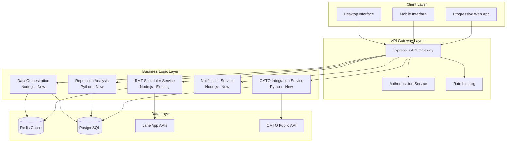
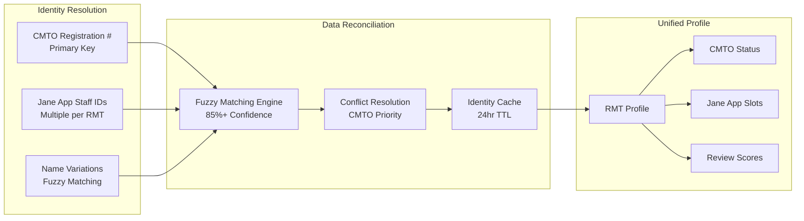

# Design Document

## Overview

The Modern RMT Platform design integrates your existing Node.js Jane App scheduling system with CMTO verification capabilities to create a comprehensive, trust-centered healthcare discovery platform. The design follows a microservices architecture with a modern, responsive frontend that prioritizes user trust, professional credibility, and seamless booking experiences.

The platform transforms from a basic availability checker into a professional-grade healthcare platform that serves three primary user types: clients seeking massage therapy, RMT professionals managing their practice, and clinic administrators overseeing multiple practitioners.

## Architecture

### System Architecture Pattern: Microservices with API Gateway

The design preserves your existing Node.js expertise while enabling seamless integration with CMTO verification systems through a microservices approach that maintains separation of concerns and enables independent scaling.



### Data Integration Architecture

The design addresses the complex challenge of integrating CMTO professional verification with Jane App scheduling data through a unified RMT identity management system.



### Caching Strategy

Multi-layered caching approach optimizes performance while maintaining data freshness for critical healthcare information.

```
Cache Architecture:
├── L1: Search Results (verified RMTs + availability) - 30 min TTL
├── L2: Individual RMT Profiles (CMTO + schedule + reputation) - 1 hour TTL  
├── L3: CMTO Verification Status - 24 hour TTL (with real-time updates)
└── L4: Availability Data - 15 min TTL (with real-time updates)

Invalidation Triggers:
├── CMTO status change → Invalidate L3 + L2 + L1
├── Availability change → Invalidate L4 + L1
├── Reputation update → Invalidate L2 + L1
└── Manual profile update → Invalidate all layers
```

## Components and Interfaces

### Frontend Component Architecture

The frontend follows a component-based architecture with reusable UI elements that maintain consistency across the platform while optimizing for different screen sizes and use cases.

#### Core Components

**SearchInterface Component**
```typescript
interface SearchInterface {
  location: LocationInput;
  dateRange: DateRangePicker;
  filters: AdvancedFilters;
  organizationFilter: OrganizationSelector;
  sortingOptions: SortingControls;
  results: SearchResults;
  
  // Methods
  performSearch(criteria: SearchCriteria): Promise<RMTResult[]>;
  applyFilters(filters: FilterOptions): void;
  loadOrganizations(): Promise<Organization[]>;
  saveSearch(criteria: SearchCriteria): void;
}

interface SearchCriteria {
  location: {
    address?: string;
    postalCode?: string;
    coordinates?: [number, number];
    radius: number;
  };
  dateRange: {
    startDate: Date;
    endDate: Date;
  };
  filters: {
    cmtoVerified: boolean;
    specialties: string[];
    availability: 'immediate' | 'within_week' | 'flexible';
    priceRange?: [number, number];
    languages?: string[];
    selectedOrganization?: string; // Organization ID filter
  };
  sorting: {
    sortBy: 'recommended' | 'name' | 'clinic' | 'price' | 'next_available' | 'rating' | 'distance' | 'availability';
    sortOrder: 'asc' | 'desc';
  };
}

interface Organization {
  id: string;
  name: string;
  url: string;
  enabled: boolean;
}
```

**RMTCard Component**
```typescript
interface RMTCard {
  rmt: RMTProfile;
  displayMode: 'compact' | 'detailed' | 'comparison';
  showAvailability: boolean;
  
  // Visual elements
  verificationBadge: CMTOBadge;
  reputationScore: ReputationDisplay;
  availabilityPreview: AvailabilitySlots;
  actionButtons: BookingActions;
}

interface RMTProfile {
  cmtoId: string;
  name: string;
  credentials: string[];
  verificationStatus: 'verified' | 'pending' | 'expired' | 'unknown';
  reputationScore: number;
  specialties: string[];
  locations: PracticeLocation[];
  nextAvailable?: AppointmentSlot;
  profileImage?: string;
}
```

**BookingFlow Component**
```typescript
interface BookingFlow {
  selectedRMT: RMTProfile;
  selectedSlot: AppointmentSlot;
  bookingMethod: 'jane_app' | 'direct_contact' | 'manual';
  
  // Booking steps
  verificationConfirmation: VerificationStep;
  appointmentDetails: AppointmentStep;
  externalIntegration: IntegrationStep;
  confirmation: ConfirmationStep;
}

interface AppointmentSlot {
  startTime: Date;
  duration: number;
  treatmentType: string;
  price: number;
  location: PracticeLocation;
  bookingUrl?: string;
  contactInfo?: ContactDetails;
}
```

### Backend Service Interfaces

**CMTO Integration Service**
```typescript
interface CMTOService {
  // Core verification methods
  verifyRMT(registrationNumber: string): Promise<CMTOVerification>;
  searchRMTs(criteria: CMTOSearchCriteria): Promise<CMTOProfile[]>;
  getRegistrationStatus(registrationNumber: string): Promise<RegistrationStatus>;
  
  // Batch operations
  batchVerifyRMTs(registrationNumbers: string[]): Promise<CMTOVerification[]>;
  syncVerificationStatus(): Promise<SyncResult>;
}

interface CMTOVerification {
  registrationNumber: string;
  status: 'active' | 'suspended' | 'expired' | 'not_found';
  name: string;
  credentials: string[];
  registrationDate: Date;
  expiryDate: Date;
  lastVerified: Date;
  specialties?: string[];
}
```

**Data Orchestration Service**
```typescript
interface DataOrchestrationService {
  // Identity resolution
  resolveRMTIdentity(cmtoId: string, janeAppIds: number[]): Promise<UnifiedRMTProfile>;
  matchRMTByName(name: string, clinic: string): Promise<MatchResult>;
  
  // Data synchronization
  syncRMTProfile(rmtId: string): Promise<SyncResult>;
  handleDataConflict(conflict: DataConflict): Promise<Resolution>;
  
  // Cache management
  invalidateRMTCache(rmtId: string): Promise<void>;
  refreshStaleData(): Promise<RefreshResult>;
}

interface UnifiedRMTProfile {
  cmtoVerification: CMTOVerification;
  janeAppProfiles: JaneAppProfile[];
  availability: AvailabilityData;
  reputation: ReputationData;
  lastUpdated: Date;
  dataQuality: QualityScore;
}
```

## Data Models

### Core Data Structures

**Unified RMT Profile Model**
```typescript
interface UnifiedRMTProfile {
  // Identity
  id: string;                          // Internal platform ID
  cmtoRegistrationNumber: string;      // Primary external key
  
  // Basic Information
  name: string;
  displayName: string;
  credentials: string[];
  profileImage?: string;
  
  // Verification
  cmtoVerification: {
    status: 'verified' | 'pending' | 'expired' | 'unknown';
    registrationNumber: string;
    expiryDate: Date;
    lastChecked: Date;
    verificationLevel: 'full' | 'partial' | 'none';
  };
  
  // Practice Information
  practiceLocations: PracticeLocation[];
  specialties: Specialty[];
  languages: string[];
  yearsExperience: number;
  
  // Availability Integration
  janeAppIntegrations: {
    clinicId: string;
    staffId: number;
    isActive: boolean;
    lastSync: Date;
  }[];
  
  // Reputation
  reputation: {
    overallScore: number;           // 0-100 scale
    reviewCount: number;
    recentTrend: 'improving' | 'stable' | 'declining';
    breakdown: {
      technicalSkills: number;
      communication: number;
      professionalism: number;
      patientExperience: number;
    };
  };
  
  // Metadata
  createdAt: Date;
  updatedAt: Date;
  dataQuality: QualityIndicator;
}
```

**Search Result Model**
```typescript
interface SearchResult {
  rmt: UnifiedRMTProfile;
  relevanceScore: number;
  matchReasons: string[];
  
  // Availability preview
  nextAvailable?: {
    date: Date;
    time: string;
    duration: number;
    price: number;
    treatmentType: string;
    location: PracticeLocation;
    bookingMethod: 'online' | 'phone' | 'email';
  };
  
  // Trust indicators
  trustLevel: 'high' | 'medium' | 'low';
  trustFactors: {
    cmtoVerified: boolean;
    recentReviews: boolean;
    activeBooking: boolean;
    completeProfile: boolean;
  };
  
  // Booking options
  bookingOptions: BookingOption[];
}
```

**Availability Integration Model**
```typescript
interface AvailabilityData {
  rmtId: string;
  clinicId: string;
  
  // Availability slots
  slots: {
    date: string;                    // YYYY-MM-DD
    timeSlots: {
      startTime: string;             // HH:MM
      endTime: string;               // HH:MM
      duration: number;              // minutes
      treatmentType: string;
      price: number;
      isAvailable: boolean;
      bookingUrl?: string;
      treatmentId?: number;
    }[];
  }[];
  
  // Data quality
  dataSource: 'real_time' | 'cached' | 'estimated';
  lastUpdated: Date;
  nextRefresh: Date;
  reliability: number;               // 0-1 confidence score
  
  // Booking integration
  bookingMethods: {
    janeApp?: {
      available: boolean;
      clinicUrl: string;
      directBooking: boolean;
    };
    phone?: {
      number: string;
      hours: string;
    };
    email?: {
      address: string;
      responseTime: string;
    };
  };
}
```

## Error Handling

### Error Classification and Response Strategy

The design implements comprehensive error handling that maintains user trust while providing graceful degradation when external systems are unavailable.

#### Error Categories

**Data Integration Errors**
```typescript
enum DataIntegrationError {
  CMTO_API_UNAVAILABLE = 'cmto_api_unavailable',
  JANE_APP_TIMEOUT = 'jane_app_timeout',
  IDENTITY_MISMATCH = 'identity_mismatch',
  STALE_DATA = 'stale_data',
  VERIFICATION_FAILED = 'verification_failed'
}

interface ErrorResponse {
  error: DataIntegrationError;
  message: string;
  fallbackData?: any;
  retryAfter?: number;
  userMessage: string;
  actionable: boolean;
}
```

**User-Facing Error Handling**
```typescript
interface ErrorHandlingStrategy {
  // CMTO verification unavailable
  cmtoUnavailable: {
    display: 'Verification status temporarily unavailable';
    fallback: 'Show cached verification with staleness indicator';
    action: 'Provide manual verification instructions';
  };
  
  // Jane App booking unavailable  
  bookingUnavailable: {
    display: 'Online booking temporarily unavailable';
    fallback: 'Show contact information with verification context';
    action: 'Enable availability alerts for when booking returns';
  };
  
  // Data conflicts
  dataConflict: {
    display: 'Profile information being updated';
    fallback: 'Show most recent verified information';
    action: 'Allow users to report discrepancies';
  };
}
```

### Graceful Degradation Patterns

**Verification Status Degradation**
```
Full Integration Available:
├── ✅ CMTO Verified + Real-time booking
├── Display: Full trust indicators with immediate booking

Partial Integration:
├── ✅ CMTO Verified + Contact for booking  
├── Display: Verification badge with manual contact options

Degraded Mode:
├── ⚠️ Verification pending + Available booking
├── Display: Caution indicators with booking disclaimer

Minimal Mode:
├── ❌ No verification + No booking integration
├── Display: Basic contact info with verification instructions
```

## Testing Strategy

### Testing Approach

The testing strategy focuses on integration reliability, user experience consistency, and data accuracy across the complex multi-system architecture.

#### Integration Testing Framework

**CMTO-Jane App Integration Tests**
```typescript
describe('RMT Identity Resolution', () => {
  test('should match RMT across systems with high confidence', async () => {
    const cmtoProfile = await cmtoService.verifyRMT('12345');
    const janeAppProfile = await schedulerService.getRMT('clinic-1', 5);
    
    const match = await dataOrchestration.resolveIdentity(
      cmtoProfile.registrationNumber,
      [janeAppProfile.id]
    );
    
    expect(match.confidence).toBeGreaterThan(0.85);
    expect(match.unifiedProfile.cmtoVerification.status).toBe('verified');
    expect(match.unifiedProfile.availability).toBeDefined();
  });
  
  test('should handle verification status changes', async () => {
    // Simulate CMTO status change
    await cmtoService.updateStatus('12345', 'suspended');
    
    // Verify cache invalidation
    const profile = await dataOrchestration.getRMTProfile('rmt-123');
    expect(profile.cmtoVerification.status).toBe('suspended');
    
    // Verify availability is disabled
    expect(profile.bookingEnabled).toBe(false);
  });
});
```

**User Experience Testing**
```typescript
describe('Search and Discovery Flow', () => {
  test('should prioritize verified RMTs in search results', async () => {
    const searchResults = await searchService.search({
      location: { postalCode: 'L4A 1A1', radius: 10 },
      dateRange: { startDate: new Date(), endDate: addDays(new Date(), 7) }
    });
    
    const verifiedResults = searchResults.filter(r => 
      r.rmt.cmtoVerification.status === 'verified'
    );
    
    expect(verifiedResults.length).toBeGreaterThan(0);
    expect(searchResults[0].trustLevel).toBe('high');
  });
  
  test('should handle booking flow with verification context', async () => {
    const bookingFlow = new BookingFlow(selectedRMT, selectedSlot);
    
    await bookingFlow.confirmVerification();
    expect(bookingFlow.verificationConfirmed).toBe(true);
    
    const bookingResult = await bookingFlow.initiateBooking();
    expect(bookingResult.verificationContext).toBeDefined();
  });
});
```

#### Performance Testing Targets

**Response Time Requirements**
```
Search Operations:
├── Initial search: < 2 seconds
├── Filter application: < 500ms
├── Profile loading: < 1 second
└── Availability refresh: < 3 seconds

Data Synchronization:
├── CMTO verification: < 5 seconds
├── Jane App availability: < 3 seconds
├── Cache refresh: < 1 second
└── Conflict resolution: < 2 seconds
```

**Load Testing Scenarios**
```
Normal Load:
├── 50 concurrent users
├── 1000 searches per hour
├── 95th percentile < 3 seconds

Peak Load:
├── 200 concurrent users  
├── 5000 searches per hour
├── 95th percentile < 5 seconds

Stress Testing:
├── 500 concurrent users
├── System degradation testing
├── Recovery time measurement
```

### Accessibility Testing

**WCAG 2.1 AA Compliance Testing**
```typescript
describe('Accessibility Compliance', () => {
  test('should support full keyboard navigation', async () => {
    const searchPage = await page.goto('/search');
    
    // Test tab navigation through all interactive elements
    await page.keyboard.press('Tab');
    expect(await page.evaluate(() => document.activeElement.tagName)).toBe('INPUT');
    
    // Test search functionality with keyboard only
    await page.keyboard.type('Stouffville');
    await page.keyboard.press('Enter');
    
    const results = await page.waitForSelector('.rmt-card');
    expect(results).toBeTruthy();
  });
  
  test('should provide appropriate ARIA labels', async () => {
    const rmtCard = await page.$('.rmt-card');
    const ariaLabel = await rmtCard.getAttribute('aria-label');
    
    expect(ariaLabel).toContain('CMTO verified');
    expect(ariaLabel).toContain('reputation score');
    expect(ariaLabel).toContain('next available');
  });
});
```

### Organization Filtering and Enhanced Sorting Design

**Organization Management Service**
```typescript
interface OrganizationService {
  // Organization data management
  loadOrganizations(): Promise<Organization[]>;
  getOrganizationById(id: string): Promise<Organization>;
  getEnabledOrganizations(): Promise<Organization[]>;
  
  // Search integration
  filterRMTsByOrganization(rmts: RMTResult[], organizationId: string): RMTResult[];
  getOrganizationStats(organizationId: string): Promise<OrganizationStats>;
}

interface OrganizationStats {
  totalRMTs: number;
  availableRMTs: number;
  averageRating: number;
  totalAvailableSlots: number;
}
```

### City-Based Clinic Organization Design

**City Configuration Data Model**
```typescript
interface CityBasedConfiguration {
  cities: Record<string, CityConfiguration>;
  settings: ConfigurationSettings;
  metadata?: {
    version: string;
    lastUpdated: Date;
    migrationSource?: 'flat' | 'manual';
  };
}

interface CityConfiguration {
  id: string;
  name: string;
  displayName: string;
  enabled: boolean;
  coordinates?: [number, number];
  clinics: ClinicConfiguration[];
}

interface ClinicConfiguration {
  id: string;
  name: string;
  url: string;
  enabled: boolean;
  address?: string;
  phone?: string;
  specialties?: string[];
}
```

**City Management Service**
```typescript
interface CityService {
  // City data operations
  getAllCities(): Promise<CityConfiguration[]>;
  getCityById(cityId: string): Promise<CityConfiguration>;
  getEnabledCities(): Promise<CityConfiguration[]>;
  getCityWithClinics(cityId: string): Promise<CityWithClinics>;
  
  // City-aware clinic operations
  getClinicsByCity(cityId: string): Promise<ClinicConfiguration[]>;
  filterClinicsByCity(clinics: ClinicConfiguration[], cityId: string): ClinicConfiguration[];
  
  // Configuration migration
  migrateFromFlatConfiguration(flatConfig: any): CityBasedConfiguration;
  detectConfigurationFormat(config: any): 'flat' | 'city-based';
}

interface CityWithClinics {
  id: string;
  name: string;
  displayName: string;
  enabled: boolean;
  clinics: ClinicConfiguration[];
  clinicCount: number;
}
```

**City Selector Component**
```typescript
interface CitySelector {
  cities: CityOption[];
  selectedCity: string | null;
  isLoading: boolean;
  
  // Event handlers
  onCityChange: (cityId: string | null) => void;
  
  // Configuration
  showAllCitiesOption: boolean;
}

interface CityOption {
  id: string;
  name: string;
  displayName: string;
  clinicCount: number;
  enabled: boolean;
}
```

**Enhanced Sidebar with City Grouping**
```typescript
interface CityGroupedSidebar {
  cities: CityWithClinics[];
  selectedCity: string | null;
  activeClinicIndex: number;
  sidebarOpen: boolean;
  expandedCities: Set<string>;
  
  // Event handlers
  onCityToggle: (cityId: string) => void;
  onClinicSelect: (clinicId: string, index: number) => void;
  onSidebarToggle: () => void;
}
```

**Enhanced Sorting Implementation**
```typescript
interface SortingService {
  sortResults(results: RMTResult[], criteria: SortCriteria): RMTResult[];
  getSortingOptions(): SortOption[];
}

interface SortCriteria {
  sortBy: 'recommended' | 'name' | 'clinic' | 'price' | 'next_available' | 'rating' | 'distance' | 'availability';
  sortOrder: 'asc' | 'desc';
}

interface SortOption {
  value: string;
  label: string;
  description: string;
  icon?: string;
}

// Sorting algorithms
const sortingAlgorithms = {
  name: (a: RMTResult, b: RMTResult, order: 'asc' | 'desc') => {
    const comparison = a.rmt.name.localeCompare(b.rmt.name);
    return order === 'asc' ? comparison : -comparison;
  },
  
  clinic: (a: RMTResult, b: RMTResult, order: 'asc' | 'desc') => {
    const comparison = (a.rmt.clinic || '').localeCompare(b.rmt.clinic || '');
    return order === 'asc' ? comparison : -comparison;
  },
  
  price: (a: RMTResult, b: RMTResult, order: 'asc' | 'desc') => {
    const aPrice = a.nextAvailable?.price || Infinity;
    const bPrice = b.nextAvailable?.price || Infinity;
    return order === 'asc' ? aPrice - bPrice : bPrice - aPrice;
  },
  
  next_available: (a: RMTResult, b: RMTResult, order: 'asc' | 'desc') => {
    const aDate = a.nextAvailable?.date || new Date('2099-12-31');
    const bDate = b.nextAvailable?.date || new Date('2099-12-31');
    const comparison = aDate.getTime() - bDate.getTime();
    return order === 'asc' ? comparison : -comparison;
  }
};
```

**Frontend Organization Filter Component**
```typescript
interface OrganizationSelector {
  organizations: Organization[];
  selectedOrganization: string | null;
  isLoading: boolean;
  
  // Methods
  onOrganizationChange: (organizationId: string | null) => void;
  loadOrganizations: () => Promise<void>;
  clearSelection: () => void;
}

// Component implementation
const OrganizationFilter: React.FC<OrganizationSelectorProps> = ({
  organizations,
  selectedOrganization,
  onOrganizationChange,
  isLoading
}) => {
  return (
    <div className="organization-filter">
      <label className="block text-sm font-medium text-gray-700 mb-2">
        Filter by Organization
      </label>
      <select
        value={selectedOrganization || ''}
        onChange={(e) => onOrganizationChange(e.target.value || null)}
        disabled={isLoading}
        className="w-full border border-gray-300 rounded-md px-3 py-2 focus:outline-none focus:ring-2 focus:ring-primary-500"
      >
        <option value="">All Organizations</option>
        {organizations.map((org) => (
          <option key={org.id} value={org.id}>
            {org.name}
          </option>
        ))}
      </select>
    </div>
  );
};
```

This design document provides a comprehensive technical foundation for upgrading your RMT platform with modern UI standards, organization filtering, enhanced sorting, and CMTO integration. The architecture preserves your existing Node.js expertise while enabling seamless integration with professional verification systems, creating a trusted healthcare discovery platform.